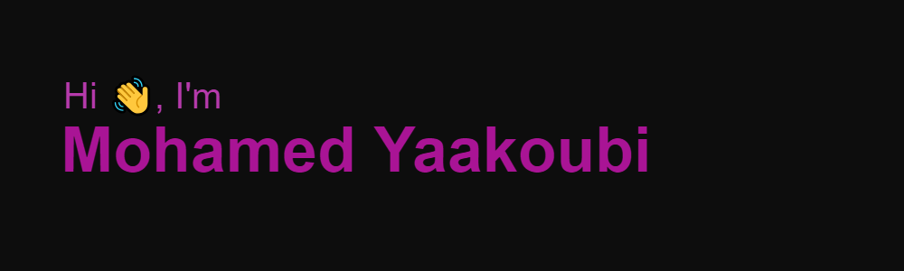
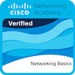

<!--❓- Intro-->
<h3 style="text-align: center; position: relative;">
  Welcome to My Profile! 
  
   
  
</h3>

I'm Mohamed Yaakoubi, a self-motivated, fast learner who picks up new skills quickly. I'm hardworking and hungry for knowledge. I seek a challenging environment that encourages and provides exposure to new ideas, doing it to the best of my conscience and knowledge which stimulates personal and professional growth.

### 🔭 I’m currently working in:
- Freelance Editor (Arabic to English & English to Arabic) at Unbabel
- Crowdsourced Data Contributor at Premise
- Freelance AI Data Annotator at Toloka
- TED Translator Volunteer at TED Translators

### 🌱 I’m currently learning:
-Ethical Hacking with Cisco Networking Academy.
-Artificial Intelligence (AI) with Tunisian Virtual University (UVT).

### 🎓✨ I finished learning:
-Fullstack Web Development through the "Mentor Nations, Develop for Nations" bootcamp, which covered HTML, CSS, JavaScript, TypeScript, React, Firebase, and DevOps.
-AI Fundamentals with IBM.
-Introduction to Cybersecurity and Networking Basics by Cisco Networking Academy.
-Introduction to 3D Printing through the American Corner Tunis.

### 👯 I’m looking to collaborate on:
- AI and machine learning projects
- Web development and software development projects

### 🤔 I’m looking for help with:
- Enhancing my knowledge in AI and machine learning
- Exploring opportunities in gaming and localization
- Building an AI project that benefits society.

### 💬 Ask me about:
- Freelance editing and translation
- Data annotation for AI projects

### 📫 How to reach me:
- **Phone:** +216 54711524
- **Email:** yakoubimohamed@fss.u-sfax.tn
- **LinkedIn:** [Mohamed Yaakoubi](https://www.linkedin.com/in/yaakoubi-mohamed/)
- **Location:** Sfax, Tunisia

### ⚡ Fun fact:
- I love traveling, camping, playing chess, and gaming in my free time!

## 🌐 Socials

## 🌟 Portfolio

## 💻 Tech Stack

## Badges

  

For more details, you can view the badges on [Credly](https://www.credly.com/badges/4ded1472-5a10-4b7d-ba8a-fae8458d2fa9/public_url) and for [verification](https://www.credly.com/go/FuFICNPo).

## 📊 GitHub Stats

## 🏆 GitHub Trophies

## 🔥 GitHub Streak Stats

---

