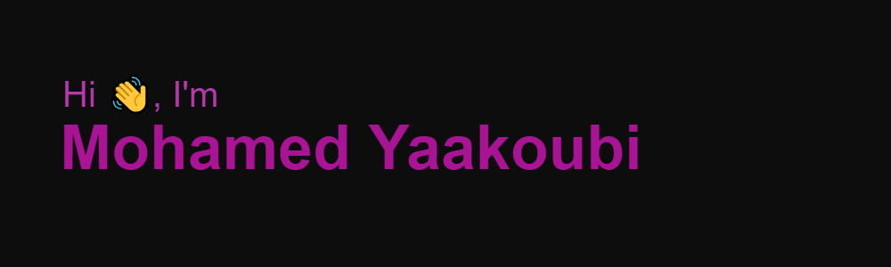

<!--❓- Intro-->
<h3 style="text-align: center; position: relative;">
  Welcome to My Profile! 
  
   
  
</h3>

Driven, adaptable, and passionate about advancing technology, I am a fast learner who thrives on tackling complex challenges and acquiring new skills quickly. With hands-on experience in AI, web development, and localization, I seek opportunities that foster innovation and personal growth. I am dedicated to leveraging my technical and problem-solving abilities to create solutions that make a meaningful difference. Eager to join collaborative environments, I aim to contribute effectively and grow alongside motivated teams.

### 🔭 I’m currently working in:
- Freelance Editor (Arabic to English & English to Arabic) at Unbabel
- Crowdsourced Data Contributor at Premise
- Freelance AI Data Annotator at Toloka
- TED Translator Volunteer at TED Translators
- Localization Vendor Coordinator at Uber, handling AI prompt evaluation, translation, and transcription
- Language Data and Quality Reviewer at Volga Partners

### 🌱 I’m currently learning:
- Ethical Hacking with Cisco Networking Academy.                        
- Artificial Intelligence (AI) with Tunisia Virtual University (UVT).

### 🎓✨ I finished learning:
- Full-stack Web Development through the "Mentor Nations, Develop for Nations" bootcamp, which covered HTML, CSS, JavaScript, TypeScript, React, Firebase, and DevOps.                                 
- AI Fundamentals with IBM.                        
- Introduction to Cybersecurity and Networking Basics by Cisco Networking Academy.                            
- Introduction to 3D Printing through the American Corner Tunis.

### 👯 I’m looking to collaborate on:
- AI and machine learning projects
- Web development and software development projects

### 🤔 I’m looking for help with:
- Enhancing my knowledge in AI and machine learning
- Exploring opportunities in gaming and localization
- Building an AI project that benefits society.

### 💬 Ask me about:
- Freelance editing and translation
- Data annotation for AI projects

### 📫 How to reach me:
- **Phone:** +216 54711524
- **Email:** amirrak8@gmail.com
- **LinkedIn:** [Mohamed Yaakoubi](https://www.linkedin.com/in/yaakoubi-mohamed/)
- **Location:** Sfax, Tunisia

### ⚡ Fun fact:
- I love traveling, camping, playing chess, and gaming in my free time!

## 🌐 Socials

 
   
   
   
   
  
  

## 🌟 Portfolios & Freelance Profiles

      

## 💻 Tech Stack

![CSS](https://img.shields.io/badge/CSS-1572B6?style=for-the-badge&logo=)

![Canva](https://img.shields.io/badge/Canva-00C4CC?style=for-the-badge&logo=)

![Azure](https://img.shields.io/badge/Azure-0078D4?style=for-the-badge&logo=)

![ChatGPT](https://img.shields.io/badge/ChatGPT-10A37F?style=for-the-badge&logo=)
![Gemini](https://img.shields.io/badge/Gemini-4285F4?style=for-the-badge&logo=)
![Grok](https://img.shields.io/badge/Grok-000000?style=for-the-badge&logo=)

![Microsoft Teams](https://img.shields.io/badge/Microsoft_Teams-6264A7?style=for-the-badge&logo=)
![Slack](https://img.shields.io/badge/Slack-4A154B?style=for-the-badge&logo=)
![Microsoft 365](https://img.shields.io/badge/Microsoft_365-D83B01?style=for-the-badge&logo=)

![VS Code](https://img.shields.io/badge/VS_Code-007ACC?style=for-the-badge&logo=)

![Google Apps Script](https://img.shields.io/badge/Google%20Apps%20Script-4285F4?style=for-the-badge&logo=)

## Badges

  

For more details, you can view the badges on [Credly](https://www.credly.com/badges/4ded1472-5a10-4b7d-ba8a-fae8458d2fa9/public_url) and for [verification](https://www.credly.com/go/FuFICNPo).

## 📊 GitHub Stats

## 🏆 GitHub Trophies

## 🔥 GitHub Streak Stats

---
## ☕ Let's have a coffee together

